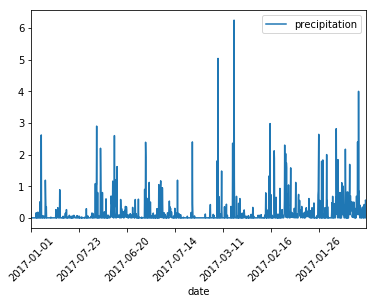
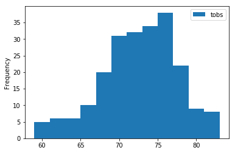
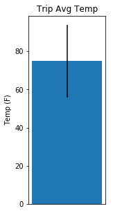

# Step 1 - Data Engineering

The climate data for Hawaii is provided through two CSV files. Start by using Python and Pandas to inspect the content of these files and clean the data.


*  Create a Jupyter Notebook file called data_engineering.ipynb and use this to complete all of your Data Engineering tasks.
*  Use Pandas to read in the measurement and station CSV files as DataFrames.
*  Inspect the data for NaNs and missing values. You must decide what to do with this data.
*  Save your cleaned CSV files with the prefix clean_.

### Dependencies


```python
import pandas as pd
import numpy as np
```

Read .csv files into Pandas DataFrames


```python
measurements = pd.read_csv("Resources/hawaii_measurements.csv")
stations = pd.read_csv("Resources/hawaii_stations.csv")
```

measurements is long, I want the header


```python
measurements.head(1)
```


<div>
<table border="1" class="dataframe">
  <thead>
    <tr style="text-align: right;">
      <th></th>
      <th>station</th>
      <th>date</th>
      <th>prcp</th>
      <th>tobs</th>
    </tr>
  </thead>
  <tbody>
    <tr>
      <th>0</th>
      <td>USC00519397</td>
      <td>2010-01-01</td>
      <td>0.08</td>
      <td>65</td>
    </tr>
  </tbody>
</table>
</div>


stations is short, it's okay to print it all out.


```python
stations
```


<div>
<table border="1" class="dataframe">
  <thead>
    <tr style="text-align: right;">
      <th></th>
      <th>station</th>
      <th>name</th>
      <th>latitude</th>
      <th>longitude</th>
      <th>elevation</th>
    </tr>
  </thead>
  <tbody>
    <tr>
      <th>0</th>
      <td>USC00519397</td>
      <td>WAIKIKI 717.2, HI US</td>
      <td>21.27160</td>
      <td>-157.81680</td>
      <td>3.0</td>
    </tr>
    <tr>
      <th>1</th>
      <td>USC00513117</td>
      <td>KANEOHE 838.1, HI US</td>
      <td>21.42340</td>
      <td>-157.80150</td>
      <td>14.6</td>
    </tr>
    <tr>
      <th>2</th>
      <td>USC00514830</td>
      <td>KUALOA RANCH HEADQUARTERS 886.9, HI US</td>
      <td>21.52130</td>
      <td>-157.83740</td>
      <td>7.0</td>
    </tr>
    <tr>
      <th>3</th>
      <td>USC00517948</td>
      <td>PEARL CITY, HI US</td>
      <td>21.39340</td>
      <td>-157.97510</td>
      <td>11.9</td>
    </tr>
    <tr>
      <th>4</th>
      <td>USC00518838</td>
      <td>UPPER WAHIAWA 874.3, HI US</td>
      <td>21.49920</td>
      <td>-158.01110</td>
      <td>306.6</td>
    </tr>
    <tr>
      <th>5</th>
      <td>USC00519523</td>
      <td>WAIMANALO EXPERIMENTAL FARM, HI US</td>
      <td>21.33556</td>
      <td>-157.71139</td>
      <td>19.5</td>
    </tr>
    <tr>
      <th>6</th>
      <td>USC00519281</td>
      <td>WAIHEE 837.5, HI US</td>
      <td>21.45167</td>
      <td>-157.84889</td>
      <td>32.9</td>
    </tr>
    <tr>
      <th>7</th>
      <td>USC00511918</td>
      <td>HONOLULU OBSERVATORY 702.2, HI US</td>
      <td>21.31520</td>
      <td>-157.99920</td>
      <td>0.9</td>
    </tr>
    <tr>
      <th>8</th>
      <td>USC00516128</td>
      <td>MANOA LYON ARBO 785.2, HI US</td>
      <td>21.33310</td>
      <td>-157.80250</td>
      <td>152.4</td>
    </tr>
  </tbody>
</table>
</div>


Within measurements are some null or missing values, mostly under prcp.  Let's fill those with 0 measurements and write it to a .csv


```python
measurements.fillna(0).to_csv("Resources/clean_hawaii_measurements.csv", index=None)
stations.fillna(0).to_csv("Resources/clean_hawaii_stations.csv", index=None)
```


# Step 2 - Database Engineering

Use SQLAlchemy to model your table schemas and create a sqlite database for your tables. You will need one table for measurements and one for stations.


*  Create a Jupyter Notebook called database_engineering.ipynb and use this to complete all of your Database Engineering work.
*  Use Pandas to read your cleaned measurements and stations CSV data.
*  Use the engine and connection string to create a database called hawaii.sqlite.
*  Use declarative_base and create ORM classes for each table.
    *  You will need a class for Measurement and for Station.
    *  Make sure to define your primary keys.
*  Once you have your ORM classes defined, create the tables in the database using create_all.

### Dependencies, set up SQLAlchemy


```python
import pandas as pd
import numpy as np
import sqlalchemy
from sqlalchemy.orm import Session
from sqlalchemy import create_engine, func, Column, Integer, String, Float
from sqlalchemy.ext.declarative import declarative_base
Base = declarative_base()
```

Read measurements and stations into Pandas DataFrames from the clean .csvs


```python
measurements = pd.read_csv("Resources/clean_hawaii_measurements.csv")
stations = pd.read_csv("Resources/clean_hawaii_stations.csv")
```

Create a database called hawaii.sqlite


```python
engine = create_engine('sqlite:///hawaii.sqlite')
```

Set up Measurement and Stations tables as class(Base)


```python
class Measurements(Base):
    __tablename__ = 'measurements'
    id = Column(Integer, primary_key=True)
    station = Column(String)
    date = Column(String)
    prcp = Column(Float)
    tobs = Column(Integer)
```


```python
class Stations(Base):
    __tablename__ = "stations"
    id = Column(Integer, primary_key=True)
    station = Column(String)
    name = Column(String)
    latitude = Column(Float)
    longitude = Column(Float)
    elevation = Column(Float)
```

All your Base etc etc actually making those tables in the database


```python
Base.metadata.create_all(engine)
```

Use Session to put the data into the database


```python
session = Session(engine)
```


```python
for index, key in stations.iterrows():
    session.add(Stations(station=key['station'], 
                         name=key['name'], 
                         latitude=key['latitude'], 
                         longitude=key['longitude'], 
                         elevation=key['elevation']
                        ))
```


```python
for index, key in measurements.iterrows():
    session.add(Measurements(station=key['station'],
                            date=key['date'],
                            prcp=key['prcp'],
                            tobs=key['tobs']
                            ))
```


```python
session.commit()
```

This way would've worked too


```python
#stations.to_sql('stations', engine, if_exists='append', index=stations.index)
#measurements.to_sql('measurements', engine, if_exists='append', index=measurements.index)
```


# Step 3 - Climate Analysis and Exploration

You are now ready to use Python and SQLAlchemy to do basic climate analysis and data exploration on your new weather station tables. All of the following analysis should be completed using SQLAlchemy ORM queries, Pandas, and Matplotlib.


*  Create a Jupyter Notebook file called climate_analysis.ipynb and use it to complete your climate analysis and data exporation.
*  Choose a start date and end date for your trip. Make sure that your vacation range is approximately 3-15 days total.
*  Use SQLAlchemy create_engine to connect to your sqlite database.
*  Use SQLAlchemy automap_base() to reflect your tables into classes and save a reference to those classes called Station and Measurement.

### Dependencies


```python
import pandas as pd
import numpy as np
import matplotlib.pyplot as plt
import datetime as dt
import sqlalchemy
from sqlalchemy.ext.automap import automap_base
from sqlalchemy.orm import Session
from sqlalchemy import create_engine, func
from flask import jsonify
```

Create engine connected to hawaii.sqlite database


```python
engine = create_engine("sqlite:///hawaii.sqlite")
```

Prepare an automap base to reflect tables


```python
Base = automap_base()
```


```python
Base.prepare(engine, reflect=True)
```


```python
Base.classes.keys()
```


    ['measurements', 'stations']


```python
Measurements = Base.classes.measurements
Stations = Base.classes.stations
```

## Precipitation Analysis


*  Design a query to retrieve the last 12 months of precipitation data.
*  Select only the date and prcp values.
*  Load the query results into a Pandas DataFrame and set the index to the date column.
*  Plot the results using the DataFrame plot method.
*  Use Pandas to print the summary statistics for the precipitation data.

Session magics to the engine


```python
session = Session(engine)
```

Make an empty table weather_data, and use a for loop to put date and precipitation since a year ago (the table ends at 2018, so I opted to take the last 12 months of data) into that table


```python
weather_data = []
for row in session.query(Measurements.date, Measurements.prcp).\
    filter(Measurements.date > '2017-00-00').all():
    weather_data.append(row)
```

DataFrame that table, set it up to visualize


```python
weatherdf = pd.DataFrame(weather_data)
weatherdf = weatherdf.set_index('date')
weatherdf.rename(columns={'prcp': 'precipitation'}, inplace=True)
```

Visualize!


```python
weatherdf.plot()
plt.xlabel('date')
plt.xticks(rotation=45)
plt.show()
```





Sumary Statistics


```python
weatherdf.describe()
```


<div>
<table border="1" class="dataframe">
  <thead>
    <tr style="text-align: right;">
      <th></th>
      <th>precipitation</th>
    </tr>
  </thead>
  <tbody>
    <tr>
      <th>count</th>
      <td>1397.000000</td>
    </tr>
    <tr>
      <th>mean</th>
      <td>0.150487</td>
    </tr>
    <tr>
      <th>std</th>
      <td>0.434943</td>
    </tr>
    <tr>
      <th>min</th>
      <td>0.000000</td>
    </tr>
    <tr>
      <th>25%</th>
      <td>0.000000</td>
    </tr>
    <tr>
      <th>50%</th>
      <td>0.000000</td>
    </tr>
    <tr>
      <th>75%</th>
      <td>0.090000</td>
    </tr>
    <tr>
      <th>max</th>
      <td>6.250000</td>
    </tr>
  </tbody>
</table>
</div>


## Station Analysis


*  Design a query to calculate the total number of stations.
*  Design a query to find the most active stations.
    *  List the stations and observation counts in descending order
    *  Which station has the highest number of observations?
*  Design a query to retrieve the last 12 months of temperature observation data (tobs).
    *  Filter by the station with the highest number of observations.
    *  Plot the results as a histogram with bins=12.

Query the total number of stations


```python
session.query(func.count(Stations.station)).all()
```


    [(9)]


Find the most active station, USC00519281 has the highest number of observations.


```python
session.query(Stations.station, func.count(Measurements.station)).\
filter(Stations.station == Measurements.station).\
group_by(Stations.station).\
order_by(func.count(Measurements.station).desc()).all()
```


    [('USC00519281', 2772),
     ('USC00519397', 2724),
     ('USC00513117', 2709),
     ('USC00519523', 2669),
     ('USC00516128', 2612),
     ('USC00514830', 2202),
     ('USC00511918', 1979),
     ('USC00517948', 1372),
     ('USC00518838', 511)]


Retrieve the last 12 months of temperature observation data, tobs, filtered by the station with the most observations.


```python
most_observed = session.query(Stations.station, func.count(Measurements.station)).\
filter(Stations.station == Measurements.station).\
group_by(Stations.station).\
order_by(func.count(Measurements.station).desc()).first()[0]
```


```python
stationdf = session.query(Measurements.station, Measurements.tobs).\
filter(Stations.station == Measurements.station).\
filter(Measurements.date > '2017-00-00').\
filter(Measurements.station == most_observed).all()
```


```python
stationdf = pd.DataFrame(stationdf, index=None)
```

Plot as a histogram with bins=12


```python
stationdf.plot(kind='hist', bins=12)
plt.show()
```





## Temperature Analysis


*  Write a function called calc_temps that will accept a start date and end date in the format %Y-%m-%d and return the minimum, average, and maximum temperatures for that range of dates.
*  Use the calc_temps function to calculate the min, avg, and max temperatures for your trip using the matching dates from the previous year (i.e. use "2017-01-01" if your trip start date was "2018-01-01")
*  Plot the min, avg, and max temperature from your previous query as a bar chart.
    *  Use the average temperature as the bar height.
    *  Use the peak-to-peak (tmax-tmin) value as the y error bar (yerr).


```python
def calc_temps(sdate, edate):
    return session.query(func.min(Measurements.tobs), func.avg(Measurements.tobs), func.max(Measurements.tobs)).\
    filter(Measurements.date >= sdate).\
    filter(Measurements.date <= edate).all()
```


```python
session.query(func.min(Measurements.tobs), func.avg(Measurements.tobs), func.max(Measurements.tobs))\
.filter(Measurements.date >= "2017-05-13").filter(Measurements.date <= "2017-05-28").all()
```


    [(68, 74.91111111111111, 87)]


```python
[(tmin, tavg, tmax)] = calc_temps("2017-05-13", "2017-05-28")
```


```python
plt.figure(figsize=(2,5))
plt.bar(height=tavg, x=0, yerr=tmax-tmin)
plt.title("Trip Avg Temp")
plt.ylabel("Temp (F)")
plt.xticks([])
plt.show()
```




